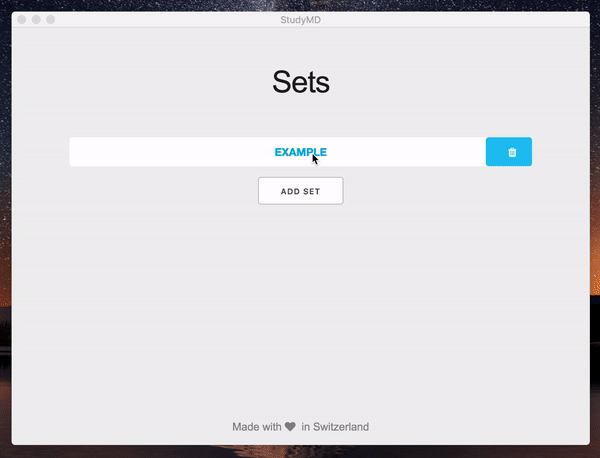

<h1 align="center">
  
  <br>
  StudyMD
  <br>
</h1>

### About
A cool app to study with markdown.
Turns your Markdown-Summaries to Flashcard.



###### Example (Card-Title header-level is choosable):

```markdown
# Example
### Use Markdown
**Bold** *Italic* and [link](github.com)
### Use Tables
| 1    | first step  |
| ---- | ----------- |
| 2    | second step |
| 3    | third step  |
### *Math!!* e.g. What is f(x)?
$y = \frac{27}{4}$
```


### Stack/Dependencies
<a href="https://electronjs.org"> </a>
[](https://facebook.github.io/react/)
[](https://github.com/ReactTraining/react-router)
[](https://yarnpkg.com/)
<a href="https://pouchdb.com/"> </a>

and:
- [markdown-it](https://github.com/markdown-it/markdown-it)
- [markdown-it-katex](https://github.com/waylonflinn/markdown-it-katex)
- [Moustrap](https://github.com/ccampbell/mousetrap)
- [react-modal](https://github.com/reactjs/react-modal)
- [Skeleton](https://github.com/dhg/Skeleton)


### Download

To download for Mac, Windows or Linux click [here](https://github.com/jotron/StudyMD/releases).

### Run Locally

You will need yarn and git.

```bash
# Clone this repository
git clone https://github.com/jotron/StudyMD.git
# Go into the repository
cd StudyMD
# Install dependencies
yarn install
# Run the app
yarn start
```


### License

MIT © Joel André
